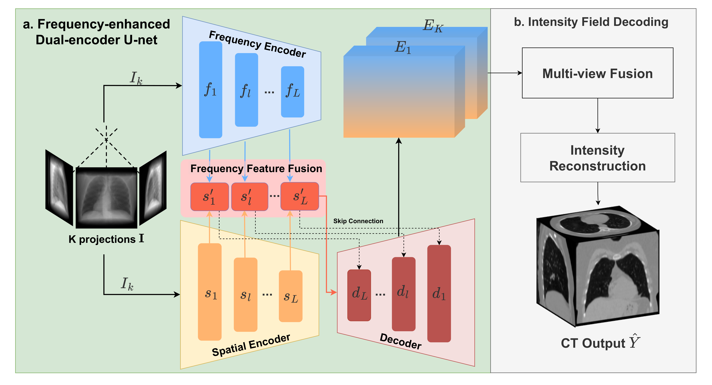

# DuFal: Dual-Frequency-Aware Learning for High-Fidelity Extremely Sparse-View CBCT Reconstruction

Cuong Tran, Trong-Thang Pham, Son Nguyen, Duy Minh Ho Nguyen, Ngan Le

## :tada: [Accepted at Transactions on Machine Learning Research (TMLR), December 2025](https://openreview.net/pdf?id=2wAZjAtK16)

[](https://openreview.net/forum?id=2wAZjAtK16)

---

## Abstract
Sparse-view Cone-Beam Computed Tomography reconstruction from limited X-ray projections remains a challenging problem in medical imaging due to the inherent undersampling of fine-grained anatomical details, which correspond to high-frequency components.
Conventional CNN-based methods often struggle to recover these fine structures, as they are typically biased toward learning low-frequency information.
To address this challenge, this paper presents **DuFal (Dual-Frequency-Aware Learning)**, a novel framework that integrates frequency-domain and spatial-domain processing via a dual-path architecture.
The core innovation lies in our **High-Local Factorized Fourier Neural Operator**, which comprises two complementary branches: a Global High-Frequency Enhanced Fourier Neural Operator that captures global frequency patterns and a Local High-Frequency Enhanced Fourier Neural Operator that processes spatially partitioned patches to preserve spatial locality that might be lost in global frequency analysis.
To improve efficiency, we design a **Spectral-Channel Factorization** scheme that reduces the Fourier Neural Operator parameter count.
We also design a **Cross-Attention Frequency Fusion** module to integrate spatial and frequency features effectively.
The fused features are then decoded through a Feature Decoder to produce projection representations, which are subsequently processed through an Intensity Field Decoding pipeline to reconstruct a final Computed Tomography volume.
Experimental results on the LUNA16 and ToothFairy datasets demonstrate that DuFal significantly outperforms existing state-of-the-art methods in preserving high-frequency anatomical features, particularly under extremely sparse-view settings.

<p align="center">
     <br>
  *Overview of DuFal architecture*
</p>

## 🏆 **Key Contributions**
- Dual-path encoding with spatial and frequency branches for high-frequency detail preservation.
- HiLocFFNO blocks combine global and local frequency modeling in a modular Frequency Encoder.
- Spectral-Channel Factorization (SCF) reduces FNO parameters while retaining quality.
- Cross-Attention Frequency Fusion (CAFF) merges spatial and spectral features in the frequency domain.
- Evaluated on LUNA16 and ToothFairy in extremely sparse-view settings.

---
## Table of Contents
- [📣 News](#-news)
- [🛠️ Requirements and Installation](#-requirements-and-installation)
- [📄 Configuration](#-configuration)
- [🧩 Creating splits for training and testing](#-creating-splits-for-training-and-testing)
- [🧪 Usage](#-usage)
- [🙏 Acknowledgments](#-acknowledgments)
- [📖 Citation](#-citation)
- [⚠️ Usage and License Notices](#-usage-and-license-notices)

---
## 📣 News
- **[Dec 2025]**: DuFal paper has been accepted with minor revisions at TMLR!

---
## 🛠️ Requirements and Installation
```bash
pip install torch==1.13 pytorch3d SimpleITK easydict
```

---
## 📄 Configuration
Edit `configs/config.yaml` to set your dataset path:

```yaml
dataset:
  root_dir: /path/to/your/data
```

---
## 🧩 Creating splits for training and testing
Use the official dataset splits for LUNA16 and ToothFairy. Please refer to ./data for more details on how to structure the datasets.

---
## 🧪 Usage
### Training (single GPU)
```bash
CUDA_VISIBLE_DEVICES=0 python code/train.py \
  --batch_size 1 \
  --epoch 600 \
  --dst_name ToothFairy \
  --num_views 10 \
  --random_view \
  --cfg_path ./configs/config.yaml \
  --num_workers 8 \
  --eval_interval 50 \
  --save_interval 50 \
  --setting spatial-test \
  -trunc LL-LH LL-LH LL-LH LL-LH \
  -sobel 0 0 0 0 \
  -patch 1 1 1 1 \
  -psize 16 16 16 16 \
  -fac none none dep-sep dep-sep \
  -attn 0 0 0 1 \
  -prop 0 0 0 0 \
  -swin 0 \
  -wsize 0 0 0 0 \
  -grid linear \
  -fuse 8 \
  -fno \
  -skip add \
  --use_wandb
```


Key options:
- `--dst_name`: dataset name (`LUNA16` or `ToothFairy`).
- `--num_views`: number of projection views.
- `--cfg_path`: path to the config file.
- `--setting`: run name used for logging and outputs.
- `-trunc/-sobel/-patch/-psize/-fac/-attn/-prop/-swin/-wsize/-grid/-fuse/-fno/-skip`: architecture and frequency-encoding settings (kept consistent with the paper config).

### Testing
```bash
CUDA_VISIBLE_DEVICES=1 python code/evaluate.py --epoch xxx --dst_name {LUNA16 or ToothFairy} --split test --num_views 10 --out_res_scale 1.0 --setting xxx
```


---
## 🙏 Acknowledgments
This project builds upon the [DIF-Gaussian](https://github.com/xmed-lab/DIF-Gaussian) codebase.

---
## 📖 Citation
If you find this work useful, please cite our paper:

```bibtex
@article{tranvan2025dufal,
  title   = {DuFal: Dual-Frequency-Aware Learning for High-Fidelity Extremely Sparse-view CBCT Reconstruction},
  author  = {Tran Van, Cuong and Pham, Trong-Thang and Nguyen, Ngoc-Son and Ho Nguyen, Duy Minh and Le, Ngan},
  journal = {Transactions on Machine Learning Research},
  year    = {2025},
  month   = {December}
}
```

---
## ⚠️ Usage and License Notices
The model is not intended for clinical use as a medical device, diagnostic tool, or any technology for disease diagnosis, treatment, or prevention. It is not a substitute for professional medical advice, diagnosis, or treatment. Users are responsible for evaluating and validating the model to ensure it meets their needs before any clinical application.
